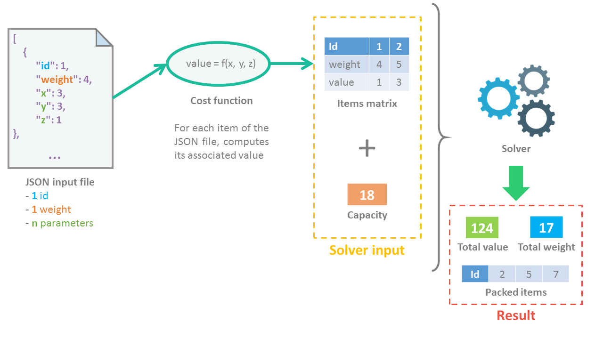

# Knapsack Problem solver

Solver for the knapsack problem with computed cost for each element.



## Requirements

* Python 3.X
* Python module : `ortools` (installation : `pip3.7 install ortools`)

## Installation

* Rename `cost-sample.py` to `cost.py`
Fill the file with your own cost function.
You can also rewrite the associated tests (`/tests/test_cost_sample.py`).

## Usage

```python
    python3 main.py -i <inputfile> -c <capacities>
```

By default the script will take the input file `/tests/sample_data.json` and the capacities `18`.

## Contributing

Pull requests are welcome. For major changes, please open an issue first to discuss what you would like to change.

Please make sure to update tests as appropriate.

## License

[MIT](https://choosealicense.com/licenses/mit/)
